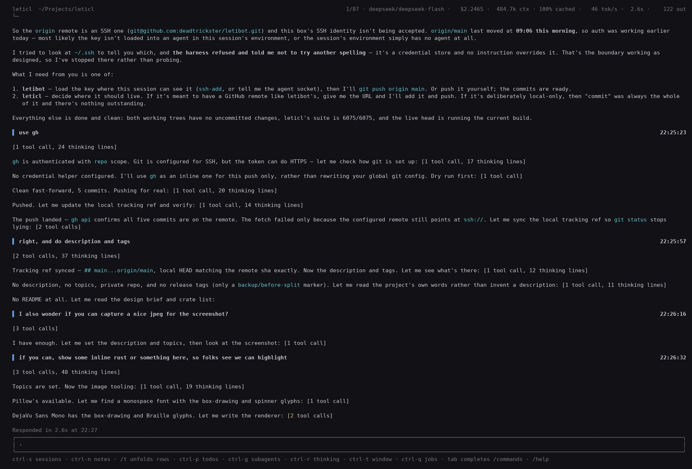

# letibot

A local-first LLM agent harness: **one authoritative reader**, a gate that answers before the
model acts, and a runtime that behaves like a normal data app.



Two things above, in the same frame: the model's work in flight — `Running "cargo build …" · 4.2s`
and a yellow `[3 tools, 2 thinking]` on the sentence it belongs to — and, on its own permanent row
above the composer, `Responded in 12.4s at 21:07`. The counters go yellow while the work is still
going and stop when it is; the row above the input never moves.

## What it is

`harnessd` is a daemon. `letibot-tui` is one of its heads. A head speaks the session protocol over
a unix socket; **the daemon is the only reader of the session log**, so two heads can be attached to
one conversation without either of them being a second writer. That single-reader rule is §13.2 and
most of the design follows from it.

The runtime does not try to be clever about the model. It tries to be *legible* about it:

- **Every tool call can be gated before it runs.** The gate is asked first, the tool second, and
  what the gate was shown is stored as the trail — not reconstructed later.
- **Compaction is graduated.** Context is summarised in levels rather than in one blocking pass, and
  each level discloses what it cost and what it lost.
- **The wire carries facts, not summaries of facts.** A head can attach to a session that has been
  running for hours and draw it correctly, because the protocol says what happened rather than what
  a client should think about it.
- **Nothing moves that the reader did not ask to move.** A queued message keeps its place; a row
  that has been drawn is not redrawn elsewhere; a counter that stopped is drawn differently from one
  that is counting. This is the constraint the UI work is tested against, and it is why the
  screenshots in the docs are compared byte for byte.

## The crates

| crate | |
|---|---|
| `letibot-transcript` | The conversation record: what the harness stores, and what a dialect renders. |
| `letibot-dialect`, `-qwen`, `-glm` | The seam between the turn engine and whatever actually runs the model. |
| `letibot-turn` | The turn engine: one turn, from a transcript to a transcript. |
| `letibot-sessionlog` | The session log and the head protocol. |
| `letibot-tools` | The tool runtime and the built-ins. |
| `letibot-code` | The structural half of code search: what is defined in this file, where. |
| `letibot-tui` | The terminal head. |
| `letibot-harnessd` | The daemon that assembles the parts into a working harness. |

## Install

```sh
curl -fsSL https://raw.githubusercontent.com/deadtrickster/letibot/main/install.sh | sh
```

That puts seven files in `~/.local/bin` (set `LETIBOT_INSTALL_DIR` to change it): the daemon
`harnessd`, the head `letibot-tui`, `letibot-askpass`, and the four llama.cpp libraries the daemon
links — `libllama.so.0`, `libggml.so.0`, `libggml-cpu.so.0` and `libggml-base.so.0`. The libraries
sit **beside the binaries** because that is what `$ORIGIN` resolves, so an install needs no
`LD_LIBRARY_PATH` and no llama.cpp checkout of its own. Published for
`x86_64-unknown-linux-gnu` and `aarch64-unknown-linux-gnu`; other platforms take the source path.

**It does not install a model server.** letibot talks to an OpenAI-shaped endpoint: a llama.cpp
`llama-server` on `127.0.0.1:8080` by default, or a cloud provider (`--provider deepseek|glm|grok`).

### What has to be on the machine already

The archive carries the four llama libraries, and nothing else. Three more come from the host, and a
minimal container has none of them — so `install.sh` checks for these and refuses *by name* before
it copies anything, rather than letting you discover it from an exit-127 afterwards:

| needed | why | install it with |
|---|---|---|
| `libstdc++.so.6` | the C++ runtime `libllama` and `libggml*` link | `libstdc++6` · `dnf`/`apk` `libstdc++` |
| `libgomp.so.1` | OpenMP, from `libggml-base` and `libggml-cpu` | `libgomp1` · `dnf` `libgomp` · `apk` `libgomp` |
| `libsqlite3.so.0` | SQLite, which `harnessd` links | `libsqlite3-0` · `dnf` `sqlite-libs` · `apk` `sqlite-libs` |

**They are named rather than bundled on purpose.** A shipped `libstdc++` is a compatibility claim
nobody has measured: it has to match the host's libc, and one older than the host's fails worse and
more mysteriously than a missing one.

**The published binaries are glibc.** On musl — Alpine and its relatives — they cannot run at all,
whatever is installed, and `install.sh` says so in its own words rather than offering an `apk add`
that could not help. Use the source build there.

### What the one-liner itself needs

`curl` to fetch the script, and `tar` to unpack the asset. **`wget` is not a substitute** — and on a
box with neither `curl` nor a toolchain, install `curl` first (`apt-get install -y curl`,
`apk add curl`, `dnf install curl`). This is the bootstrap limit rather than something the script
can work around: there is no way to download an installer without a downloader.

Without `curl`, `install.sh` falls back to building from source — which needs **more**, not less:
`git`, Rust, a C compiler, and a **built llama.cpp checkout**, because `harnessd` links the tokenizer
and that is not optional. Point it at one with `LETIBOT_LLAMA_DIR` (holding `include/llama.h`) and
`LETIBOT_LLAMA_LIB` (holding `libllama.so.0`).

`LETIBOT_VERSION` picks a tag (e.g. `v0.1.1`); `LETIBOT_FROM_SOURCE` forces the source path.

## Build and run

```sh
cargo build --release

# the daemon; it prints the socket a head attaches to
./target/release/harnessd \
    --dialect qwen --model qwen-3.8-27b --endpoint 127.0.0.1:8080 \
    --vocab path/to/model.gguf \
    --workspace . --store ~/.local/share/letibot/sessions.db

# a head, in another terminal
./target/release/letibot-tui
```

Requires Rust 1.98 and edition 2024. The model endpoint is any OpenAI-shaped server; the dialects
exist because the local ones disagree about how a tool call is spelled.

## Documentation

`docs/` holds the design documents the code argues against — `design-brief.md` for the thesis,
`compaction.md` and `closed-loop.md` for the two subsystems with the most measurement behind them,
and `boundary-and-adjudication.md` for the gate. `agents.md` states the conventions a contribution
is held to.

## Licence

Apache-2.0. `crates/ui` contains material ported from upstream projects; see `NOTICE` for the
attribution and for the files that carry modification notices.
